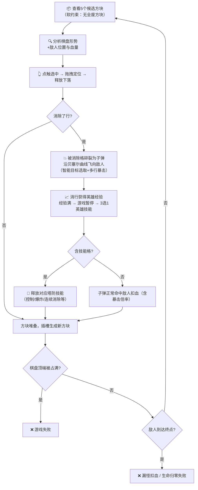

---
tags:
  - game-design
  - core-concept
  - elementris
aliases:
  - 核心概述
created: 2026-04-02
updated: 2026-04-08
---

# 01 — 核心概述

## 基本信息

| 属性 | 内容 |
| ---- | ---- |
| 游戏名称 | ELEMENTRIS（工作标题） |
| 类型 | 益智 / 策略消除 / 塔防 / 构筑成长 |
| 平台 | 移动端（iOS / Android） |
| 屏幕方向 | 竖屏 |
| 目标受众 | 休闲玩家 / 中度策略玩家 |
| 核心体验关键词 | 决策感 · 反应感 · 危机化解感 · 连锁爽感 |

---

## 四大创新支柱

> [!tip] 支柱一：预判式方块决策（软约束）
> 取消实时旋转压力操作，改为「5选1预置方块（含固定旋转）」，将秒级反应压力转化为空间规划的策略思考，门槛低、深度高。
> 生成池做**软约束**：避免三个方块同时为「烂牌」（如全s/z同向、全无法平铺），保证决策空间始终存在。

> [!tip] 支柱二：消行转化攻击
> 玩家消行时，被消除行的方块碎裂成子弹，沿**贝塞尔曲线**飞向棋盘边沿正在行进的敌人。**智能目标选取**规避溢出浪费；**多行消除**触发暴击倍率（×1.5 / ×2.0 / ×3.0），消行操作直接映射为有深度的战斗输出。

> [!tip] 支柱三：技能格系统
> 在5选1方块中概率内嵌「技能格」，被消行触发时释放塔防主动技能（13种，含控制/爆炸/全场/连续消除等），提供即时的压力释放与高峰体验，是游戏的**短周期反馈层**。

> [!tip] 支柱四：英雄成长与构筑
> 消行积累英雄经验，满经验升级暂停游戏，弹出「3选1英雄技能」构筑选择。基于三大套路（🔴高伤害 / 🔵强控制 / 🟢消除增强）设计15种英雄被动技能，提供跨关卡的**长周期成长反馈**与**重开构筑乐趣**，满足硬核策略玩家需求。

---

## 核心游戏循环



---

## 屏幕竖向区域划分

```
┌──────────────────────────────────┐
│[🧙Lv] ⏸ [分数/波次]  ❤️生命 [阶段]│  顶部 HUD 栏（约5%，英雄头像+经验环在左上）
├──────────────────────────────────┤
│  ████████████░░░░  增行倒计时     │  增行进度条（约3%，紧贴HUD下方）
├───┬──────────────────────────┬───┤
│   │  → → → → → → → → → →   │   │  顶边路径（敌人左→右）
│ ↑ ├──────────────────────────┤ ↓ │
│👾 │                          │👾 │
│👾 │   🟦 棋盘区域（约62%）   │👾 │  左边=敌人上行，右边=敌人下行
│   │      （10 × 20 格）      │   │
│👾 │                          │👾 │
│↑  ├──────────────────────────┤ ↓ │
│[起]│                         │[终]│  起点（左下）→ 终点（右下）
├───┴──────────────────────────┴───┤
│ [方块A]  [方块B]  [方块C]  [方块D]  [方块E]  │  5选1方块槽（约25%）
└──────────────────────────────────┘
```

> [!note] 敌人路径说明
> 敌人从棋盘**左下角外侧**（起点）出发：
> - **第一段**：沿棋盘左边**从下往上**行进（左下→左上）
> - **第二段**：沿棋盘顶边**从左往右**行进（左上→右上）
> - **第三段**：沿棋盘右边**从上往下**行进（右上→右下）
> - **终点**：棋盘**右下角外侧**，到达后扣玩家生命值

---

## 胜负条件

| 结果 | 触发条件 |
| ---- | -------- |
| ❌ 失败（棋盘溢出）| 棋盘顶端被占满，新方块无法生成 |
| ❌ 失败（生命耗尽）| 敌人到达终点累计扣血，生命归零 |
| ✅ 通关 | 当前波次所有敌人被消灭（待细化）|

---

## 玩法策略层次

> [!info] 浅层策略（当前决策）
> 根据棋盘形势，从3个预置方块中选出形状和旋转最契合当前空缺的方块——单步最优决策，适合休闲玩家。

> [!info] 中层策略（伤害优化）
> 预判消行后子弹数量与方向，优先针对最接近终点的敌人构造消行；利用攻击技能格的效果类型匹配当前敌人威胁（减速高速敌/爆炸集群敌）。

> [!info] 深层策略（多步规划）
> 提前2~3步规划方块，保持棋盘健康的同时为触发高价值技能格创造消行机会；底部增行时机与减速技能的配合使用。

---


| 结果 | 触发条件 |
| ---- | -------- |
| ❌ 失败 | 棋盘顶端被占满，新方块无法生成 |
| ✅ 通关 | 在当前关卡目标分数内成功将棋盘撑到关卡结束（待细化） |

> [!note] 设计备注
> 核心失败条件是棋盘溢出，压力来源由底部增行和顶部干扰方块共同构成，不再依赖HP/敌人系统。

---

## 玩法策略层次

> [!info] 浅层策略（当前决策）
> 根据棋盘形势，从3个预置方块中选出形状和旋转最契合当前空缺的方块——单步最优决策，适合休闲玩家。

> [!info] 深层策略（多步规划）
> 考虑奖励格的位置、干扰方块预警的落点、底部增行时机，提前规划2-3步方块选择；是否优先触发奖励消除、应对干扰方块——适合中度玩家发掘。

---

**相关文档：** [[02-游戏机制]] | [[03-干扰方块与预警系统]] | [[04-压力与奖励曲线]] | [[00-ELEMENTRIS-总索引]]
