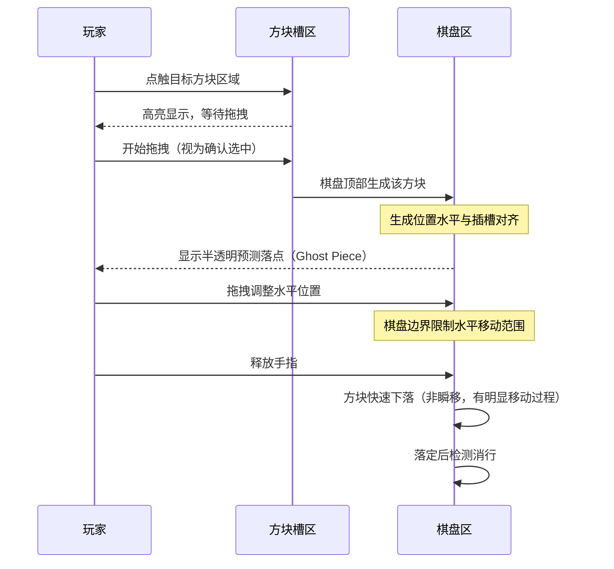
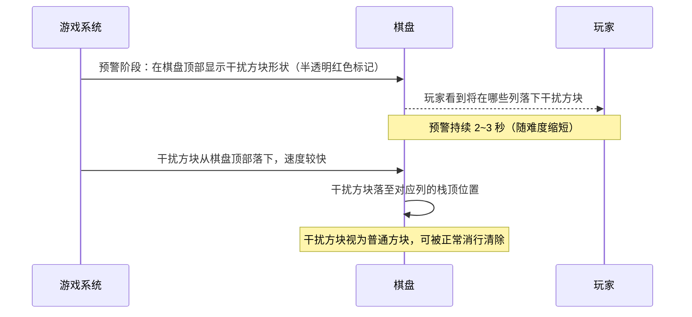

---
tags:
  - game-design
  - mechanics
  - tetris
  - elementris
aliases:
  - 游戏机制
  - 方块机制
created: 2026-04-02
updated: 2026-04-08
---

# 02 — 游戏机制

## 方块槽系统

### 基本规则

> [!info] 5选1方块槽
> - 游戏开始时，界面底部5个插槽分别填入**随机形状 + 随机旋转**的方块
> - 玩家每次从5个方块中选择1个使用
> - 其侙4个方块保留原位，系统在空出的1个槽中生成新的随机方块
> - **玩家无法主动旋转方块**——旋转状态在生成时已确定

### 方块类型

使用标准俄罗斯方块7种形状（I/O/T/S/Z/J/L），每种形状包含所有合法旋转状态，在生成时从全集中随机抽取一个状态。

| 形状 | 旋转数 | 特点 |
| ---- | ------ | ---- |
| I    | 2      | 消行利器，填充竖向或横向空隙 |
| O    | 1      | 稳定方形，适合填角 |
| T    | 4      | 万能填充，T形消行 |
| S    | 2      | 斜向填充，难以放平 |
| Z    | 2      | 斜向填充，难以放平 |
| J    | 4      | L形变体，边角填充 |
| L    | 4      | J形变体，边角填充 |

### 生成软约束规则

> [!warning] 避免「全废牌」局面
> 生成新方块时，系统执行以下软约束检测：
> - **形状去重**：禁止5个方块中出现重复形状（不同旋转也视为同形状，7选5保证不重复）
> - **旋转方向平衡**：统计当前槽中横向/纵向方块数量，若竖向偏多则优先生成横向旋转，反之亦然
> - **可放置性约束**：禁止5个方块均无法为当前棋盘提供任何可放置位置
> - 满足约束条件后，从合格候选集中随机生成，保持随机性；若多次采样都不满足约束则强制替换1个方块为可放置的未用形状（安全默认）
> - 每次只替换**1个槽位**，不影响其侙4个槽的正常随机性

> [!note] 设计意图
> 软约束不是让玩家「总有最优解」，而是保证「总有至少一个合理选项」，避免完全运气导致的挫败感，同时保留策略空间。

---

## 用户交互设计

> [!important] 仅3种输入
> 整个游戏**只响应点触、拖拽、释放**三种交互，专为移动端单手操作设计。

### 交互流程

### 交互细节规范

| 交互阶段 | 行为描述 | 设计意图 |
| -------- | -------- | -------- |
| 点触插槽区 | 高亮目标方块，但未确认选中 | 允许玩家「悔选」，减少误操作 |
| 开始拖拽 | 确认选中，方块在棋盘顶部生成 | 拖拽阈值触发，防止轻触误选 |
| 生成位置 | 水平坐标与对应插槽中心对齐 | 降低首次定位成本 |
| 拖拽移动 | 控制方块水平位置，不能超出边界 | 边界硬限制，视觉反弹提示 |
| Ghost Piece | 半透明方块显示当前水平位置的落点 | 辅助玩家预判，降低失误率 |
| 释放 | 方块快速下落至落点（有速度感的过程） | 保留视觉反馈，不用瞬移 |

> [!warning] 设计约束
> 没有旋转操作意味着「选哪块」成为关键决策点，5个方块槽的内容差异是核心策略空间。

---

## 棋盘规则

### 基本参数

| 参数 | 数值 | 说明 |
| ---- | ---- | ---- |
| 棋盘列数 | 10 | 标准俄罗斯方块宽度 |
| 棋盘行数 | 20 | 标准俄罗斯方块高度 |
| 方块下落速度 | 缓慢自动下落 | 无计时压力，压力来自底部增行 |
| 快速下落速度 | 约 300ms 到达落点 | 有明显移动过程，非瞬移 |

### 消行机制

- 一行所有格子填满时，该行**立即消除**
- 消除时：**被消除行的所有方块格碎裂为子弹**，沿贝塞尔曲线飞向棋盘外侧的敌人（详见 [[03-塔防战斗系统]]）
- 消除时检测该行中是否含有**技能格**，若有则同时释放对应塔防技能
- 多行同时消除时，形成连锁子弹爆发，所有技能格均触发

---

## 满棋盘判定

> [!warning] 触发条件
> 当任意新生成的方块**无法在棋盘顶部正常生成**（即顶部区域被占据）时，视为「满棋盘」，**立即触发游戏失败（GAME OVER）**。

> [!note] 设计说明
> - 即时失败使「维持棋盘可用空间」的核心目标清晰直接
> - 棋盘压力来源为敌人漏怒的生命値扮巭uccion（v0.5移除底部增行机制）

---

## 底部增行机制

> [!warning] 已在 v0.5 移除
> 底部增行压力机制已移除。**棋盘内唯一压力来源现为敌人漏怒堆积。**

---

**相关文档：** [[01-核心概述]] | [[03-塔防战斗系统]] | [[04-压力与奖励曲线]] | [[00-ELEMENTRIS-总索引]]

## 方块槽系统

### 基本规则

> [!info] 3选1方块槽
> - 游戏开始时，界面底部3个插槽分别填入**随机形状 + 随机旋转**的方块
> - 玩家每次从3个方块中选择1个使用
> - 其余2个方块保留原位，系统在空出的1个槽中生成新的随机方块
> - **玩家无法主动旋转方块**——旋转状态在生成时已确定

### 方块类型

使用标准俄罗斯方块7种形状（I/O/T/S/Z/J/L），每种形状包含所有合法旋转状态，在生成时从全集中随机抽取一个状态。

| 形状 | 旋转数 | 特点 |
| ---- | ------ | ---- |
| I    | 2      | 消行利器，填充竖向或横向空隙 |
| O    | 1      | 稳定方形，适合填角 |
| T    | 4      | 万能填充，T-spin 价值消除 |
| S    | 2      | 斜向填充，难以放平 |
| Z    | 2      | 斜向填充，难以放平 |
| J    | 4      | L形变体，边角填充 |
| L    | 4      | J形变体，边角填充 |

---

## 用户交互设计

> [!important] 仅3种输入
> 整个游戏**只响应点触、拖拽、释放**三种交互，专为移动端单手操作设计。

### 交互流程

### 交互细节规范

| 交互阶段 | 行为描述 | 设计意图 |
| -------- | -------- | -------- |
| 点触插槽区 | 高亮目标方块，但未确认选中 | 允许玩家「悔选」，减少误操作 |
| 开始拖拽 | 确认选中，方块在棋盘顶部生成 | 拖拽阈值触发，防止轻触误选 |
| 生成位置 | 水平坐标与对应插槽中心对齐 | 降低首次定位成本 |
| 拖拽移动 | 控制方块水平位置，不能超出边界 | 边界硬限制，视觉反弹提示 |
| Ghost Piece | 半透明方块显示当前水平位置的落点 | 辅助玩家预判，降低失误率 |
| 释放 | 方块快速下落至落点（有速度感的过程） | 保留视觉反馈，不用瞬移 |

> [!warning] 设计约束
> 没有旋转操作意味着「选哪块」成为关键决策点，5个方块槽的内容差异是核心策略空间。

---

## 棋盘规则

### 基本参数

| 参数 | 数値 | 说明 |
| ---- | ---- | ---- |
| 棋盘列数 | 10 | 标准俄罗斯方块宽度 |
| 棋盘行数 | 20 | 标准俄罗斯方块高度 |
| 方块下落速度 | 缓慢自动下落 | 无计时压力，压力来自底部增行 |
| 快速下落速度 | 约 300ms 到达落点 | 有明显移动过程，非瞬移 |

### 消行机制

- 一行所有格子填满时，该行**立即消除**
- 消除时检测该行中是否含有奖励格，若有则触发对应奖励
- 多行同时消除时，所有奖励格均触发

---

## 满棋盘判定

> [!warning] 触发条件
> 当任意新生成的方块**无法在棋盘顶部正常生成**（即顶部区域被占据）时，视为「满棋盘」，**立即触发游戏失败（GAME OVER）**。

> [!note] 设计说明
> - 移除原RPG系统中的阶梯式扣血惩罚机制，改为即时失败
> - 双重压力机制（底部增行 + 顶部干扰方块）已提供足够的渐进压力，阶梯扣血反而会模糊失败边界，削弱临界压力感
> - 即时失败使「维持棋盘可用空间」的核心目标更清晰直接

---

## 干扰方块系统

> [!warning] 顶部双重压力新机制
> 游戏周期性地从**棋盘顶部**投放干扰方块。与底部增行不同，干扰方块以**先预警、后掉落**的形式出现，给予玩家短暂的应对窗口。

### 干扰方块流程

### 干扰方块参数

| 参数 | 说明 |
| ---- | ---- |
| 形状 | 单格或2格横向条（1×1 或 1×2），不使用标准7种形状 |
| 颜色 | 深灰/红色调，与普通方块区分 |
| 预警时间 | 初始3秒，随难度递减至1秒 |
| 投放频率 | 初始低频（详见 [[04-压力与奖励曲线#干扰方块压力]]） |
| 投放列数 | 初始1列，高难度最多同时3列 |
| 消除条件 | 与普通方块相同，所在行填满即消除 |

> [!note] 设计意图
> 预警窗口是干扰方块区别于底部增行的核心体验差异：玩家**可以看到危险、需要快速决策应对**——是调整当前方块落点以减少被堵，还是优先触发奖励消除格来化解危机。

---

## 底部增行机制

> [!info] 详见 [[04-压力与奖励曲线#压力机制]]
> 棋盘会周期性地在**底部插入一行新的砖块**，该行包含随机缺口，被视为压力来源之一。

---

**相关文档：** [[01-核心概述]] | [[03-干扰方块与预警系统]] | [[04-压力与奖励曲线]] | [[00-ELEMENTRIS-总索引]]
