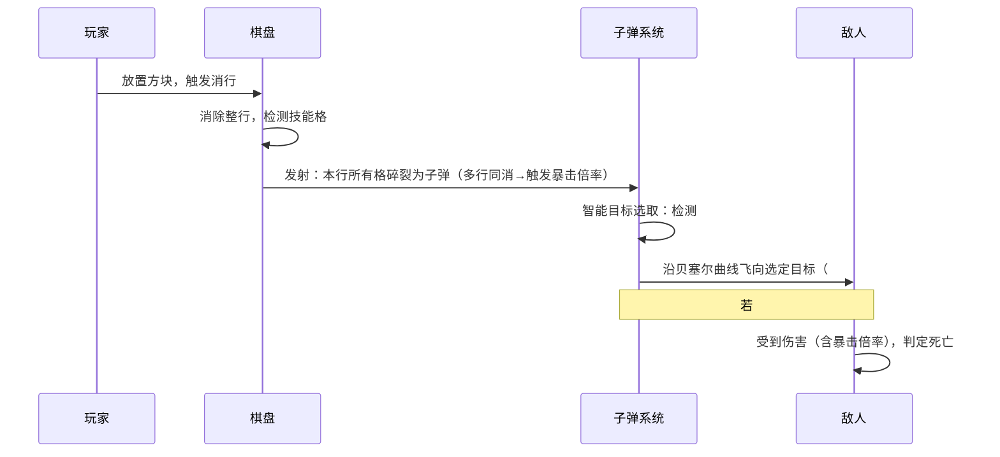
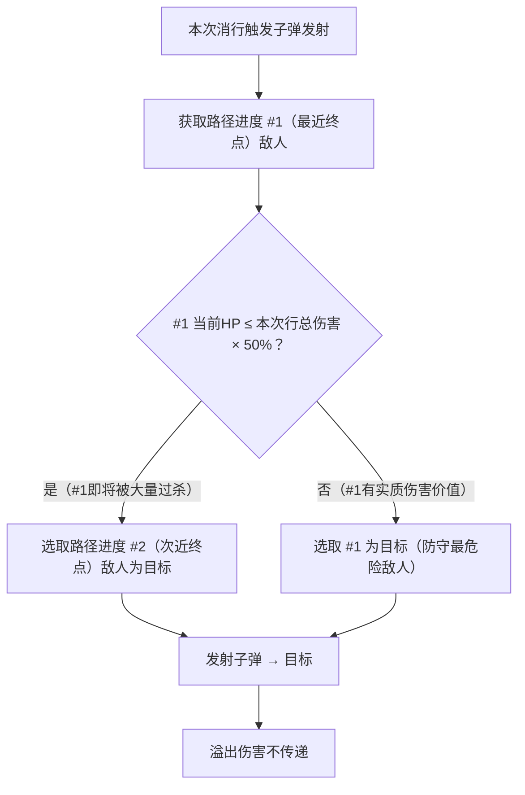

---
tags:
  - game-design
  - tower-defense
  - combat
  - elementris
aliases:
  - 塔防战斗系统
  - 战斗系统
  - 敌人系统
created: 2026-04-08
updated: 2026-04-08
---

# 03 — 塔防战斗系统

> [!abstract] 系统概述
> 塔防战斗系统是俄罗斯方块消行玩法的战斗输出层。玩家消行产生的子弹沿贝塞尔曲线攻击绕棋盘三边行进的敌人；方块中内嵌的技能格在消行时释放多样化的塔防技能，构建策略深度。

---

## 敌人行进路径

```
┌──────────────────────────┐
│  → → → → → → → → → → →  │← 顶边（第二段：左上→右上，从左往右）
│                          │
↑ 左边                右边 ↓
│（第一段：               │（第三段：
│  左下→左上）             │  右上→右下）
│  从下往上               │  从上往下
│                          │
│                          │
└──────────────────────────┘
起点（左下角外侧）         终点（右下角外侧）
```

> [!important] 路径说明
> 敌人从棋盘**左下角外侧**（起点）出发，沿棋盘外轮廓绕行三条边：
> 1. **第一段**：棋盘左边，**从下往上**行进（左下角 → 左上角）
> 2. **第二段**：棋盘顶边，**从左往右**行进（左上角 → 右上角）
> 3. **第三段**：棋盘右边，**从上往下**行进（右上角 → 右下角）
> 4. **终点**：棋盘**右下角外侧**，到达后对玩家造成生命值扣除

---

## 消行→子弹攻击机制

### 攻击流程



### 子弹伤害规则

| 参数 | 数值/规则 | 说明 |
| ---- | --------- | ---- |
| 每格伤害 | 基础伤害值（见配置表） | 一行10格 = 10发子弹 |
| 攻击目标 | **智能目标选取**（见下节） | 自动规避无效溢出 |
| 溢出伤害 | 超出当前目标HP的伤害**不传递**给下一个敌人 | 智能选取已提前规避过杀 |
| 多行同消 | 每行独立目标选取；全行子弹共享**暴击倍率** | 多行消除即触发暴击系统 |
| 飞行动画 | 贝塞尔曲线飞行，约 250~400ms 到达 | 保留视觉爽快感，不瞬移 |

---

## 智能目标选取算法

> [!info] 设计目的
> 避免将大量子弹浪费在一个「即将被过杀」的敌人身上造成无效溢出，从而让每次消行的输出效率最大化。

### 目标判定流程



### 目标切换阈值说明

| 情形 | 判定条件 | 目标选取结果 | 设计意图 |
| ---- | -------- | ------------ | -------- |
| #1 HP高 | HP ＞ 本次行总伤害×50% | 攻击 **#1**（最危险） | 优先消灭最接近终点的威胁 |
| #1 HP低 | HP ≤ 本次行总伤害×50% | 攻击 **#2**（次危险） | 避免50%以上伤害溢出浪费 |
| 仅1个敌人 | 场上只有1个敌人 | 攻击唯一敌人 | 无可切换目标，正常输出 |
| #2不存在 | 场上只有1个敌人 | 同上 | — |

> [!warning] 注意
> 目标选取在**子弹发射前**一次性判定，同一行内所有子弹攻击同一目标，不在飞行途中重新选取。

---

## 多行消除暴击系统

> [!info] 设计目的
> 同时消除多行是俄罗斯方块的高技巧操作。暴击倍率给予显著的输出奖励，配合视觉特效升级，让玩家直观感受到多行消除的爽快感，并建立「追求多行消除」的策略动机。

### 暴击倍率表

| 同时消行数 | 暴击名称 | 伤害倍率 | 子弹颜色 | 视觉提示 |
| ---------- | -------- | -------- | -------- | -------- |
| 1行 | —（无暴击） | ×1.0 | 白/蓝（标准色） | 无额外提示 |
| 2行 | **Double** | ×1.5 | 橙色 | 「Double!」文字弹出，子弹轨迹加粗 |
| 3行 | **Triple** | ×2.0 | 红色 | 「Triple!」文字 + 轻微屏幕震动 + 音效升调 |
| 4行 | **TETRIS!** | ×3.0 | 彩虹渐变 | 「TETRIS!」全幅文字 + 屏幕闪光 + 专属音效 |

> [!note] 倍率作用范围
> 暴击倍率作用于**本次多行消除事件中所有行的全部子弹**。例如双行消除×1.5：两行合计20发子弹，每发伤害均乘以1.5。

### 多行消除的目标选取行为

| 情形 | 目标选取规则 |
| ---- | ------------ |
| 多行均选中同一目标 | 集中火力，暴击伤害叠加，可快速击杀高HP敌人 |
| 行间目标不同 | 允许不同行攻击不同敌人（各行独立智能选取） |
| 含技能格的行 | 技能格效果**不叠加暴击倍率**，独立触发；普通子弹行正常享受倍率 |

---

### 贝塞尔曲线路径设计

> [!tip] 视觉设计意图
> - 子弹从棋盘内部格子的**碎裂位置**出发（原格子坐标）
> - 飞向**棋盘对应边沿上的敌人位置**
> - 控制点偏向棋盘外侧中间区域，形成自然的弧形抛物线轨迹
> - 多格同消时形成**子弹扇形散射效果**，视觉张力强
> - 暴击状态下子弹颜色变化和轨迹加粗随倍率等级递进，视觉层次清晰

---

## 技能格系统

> [!info] 概述
> 3选1候选方块在生成时，有概率在某个格子中内嵌「技能格」标记。含技能格的行被消行触发时，**立即释放对应的塔防主动技能**，提供超出普通子弹伤害的特殊战斗效果。

### 技能格生成规则

| 参数 | 规则 |
| ---- | ---- |
| 生成概率 | 每次生成3个候选方块时，概率30%在其中1个格子注入技能格 |
| 最大同时数量 | 3个候选方块中最多同时出现1个技能格 |
| 技能类型随机 | 从当前已解锁的技能池中均匀随机抽取 |
| 触发条件 | 含技能格的行被完整消除时触发（而非放置时触发） |

---

## 塔防技能列表（设计稿 v0.3）

> [!note] 技能设计目标
> 覆盖塔防游戏常见策略维度：单体高伤、范围爆炸、控制减速、持续伤害、全场清理、资源获取、防御强化、触发连消。共设计 **13 种技能**。

### 攻击类技能（直接伤害）

| 技能ID | 名称 | 图标 | 效果描述 | 设计意图 |
| ------ | ---- | ---- | -------- | -------- |
| `SKL_SNIPE` | 狙击 | 🎯 | 对路径进度最高的敌人造成**3倍基础伤害**（单体） | 针对临近终点的高危敌人一击重伤 |
| `SKL_BURST` | 爆裂 | 💥 | 以目标敌人为中心，对其**前后各1个敌人**各造成 100% 基础伤害（共3目标）| 应对密集敌群 |
| `SKL_CHAIN` | 链式闪电 | ⚡ | 对路径上**连续5个敌人**各造成 80% 基础伤害，后续目标伤害递减10% | 清理散布敌群 |
| `SKL_ARMOR_BREAK` | 破甲 | 🔨 | 对1个敌人造成 150% 伤害并使其**护甲值降低50%**，持续10秒 | 专为高甲敌人设计，配合后续伤害 |

### 控制类技能（状态效果）

| 技能ID | 名称 | 图标 | 效果描述 | 设计意图 |
| ------ | ---- | ---- | -------- | -------- |
| `SKL_FREEZE` | 冰冻 | ❄️ | 使路径进度最高的**1个敌人**完全停止移动，持续**4秒** | 为玩家争取消行时间，应对即将过线的敌人 |
| `SKL_SLOW` | 减速场 | 🌀 | 使当前路径上**所有敌人**速度降低50%，持续**6秒** | 全场节奏控制，为多次消行打伤害创造窗口 |
| `SKL_STUN` | 震荡 | 🌟 | 使路径上**最密集的3个相邻敌人**眩晕**2秒**（无法移动且受击伤害+20%）| 控制 + 增伤双效果 |
| `SKL_PULL` | 拉拽 | 🪝 | 将路径上**距离终点最近的1个敌人**向起点方向拉回**20%路径长度** | 把已经接近终点的敌人拉回，为玩家争取输出机会 |

### 全场 / 持续类技能

| 技能ID | 名称 | 图标 | 效果描述 | 设计意图 |
| ------ | ---- | ---- | -------- | -------- |
| `SKL_METEOR` | 陨石雨 | ☄️ | 在路径上随机位置**落下5颗陨石**，每颗造成基础伤害×1.5，有0.5格溅射范围 | 高伤随机分布，对密集 wave 效果佳 |
| `SKL_FIRE_ZONE` | 燃烧地带 | 🔥 | 在当前路径中段生成**燃烧区域**，持续**8秒**，敌人经过时每秒受到基础伤害×0.3 | 持续输出，适合高HP慢速敌人 |
| `SKL_NOVA` | 宇宙爆发 | 🌌 | 对**路径上所有敌人**造成基础伤害×1，无视护甲 | 终极全清技，高风险时的保底手段 |

### 辅助 / 防御类技能

| 技能ID | 名称 | 图标 | 效果描述 | 设计意图 |
| ------ | ---- | ---- | -------- | -------- |
| `SKL_SHIELD` | 护盾强化 | 🛡️ | 玩家**生命值回复 1 点**，并在接下来**2次漏怪**中生命值不扣减 | 高危时的容错缓冲，价值随剩余生命值减少而增大 |
| `SKL_AMPLIFY` | 增幅 | ✨ | 接下来**3次消行**产生的子弹伤害提升 80%，持续至消耗完毕 | 短期火力增幅，战略时机使用收益最大 |

### 特殊触发类技能

| 技能ID | 名称 | 图标 | 效果描述 | 设计意图 |
| ------ | ---- | ---- | -------- | -------- |
| `SKL_CHAIN_CLEAR` | 连续消除 | 🔗 | 自动检测棋盘中**缺口最少的1~3行**，向缺口处填入方块补全，立即触发消行判定；消除的行数计入**多行暴击倍率系统** | 一次性创造连续消除的爆发时机——技能格本身是「导火索」，制造出高暴击输出的窗口期 |

---

## 敌人基础属性

> [!info] 详见 [[CONFIG-敌人配置表]]
> 敌人分为普通、精英、Boss三档，具有HP、速度、护甲、漏怪扣血值等属性。

### 出怪节奏（波次系统）

> [!tip] 波次设计
> 参考主流塔防游戏，敌人以**波次（Wave）**方式出现，而非逐一零散生成。

| 参数 | 数值 | 说明 |
| ---- | ---- | ---- |
| 基础波次规模 | 5只 | 第1波5只敌人 |
| 波次规模增长 | +1只/每2波 | 上限12只（例：第5波7只，第10波10只） |
| 波内出怪间隔 | 初始1.2s，随波次缩短（最低0.6s） | 同波内敌人密集出现 |
| 波间冷却 | 初始7s，随波次缩短（最低4s） | 玩家有短暂喘息机会 |
| 出怪类型 | 普通→精英（500分后）→Boss（2000分后）混合 | 进阶压力逐步引入 |

```
波次时间线示意：
|←──7s 冷却──→|←──波内1.2s×5只──→|←──6.8s 冷却──→|←──波内1.15s×6只──→|
        Wave 1（5只）                      Wave 2（6只）
```

### 属性说明

| 属性 | 说明 |
| ---- | ---- |
| HP | 生命值，子弹伤害扣除 |
| 速度 | 单位时间内移动的路径距离百分比 |
| 护甲 | 减少受到的物理伤害（百分比减免） |
| 漏怪扣血 | 到达终点后扣除玩家生命的数量 |
| 击晕免疫 | 部分精英/Boss免疫冰冻/眩晕 |

---

## 生命值系统

| 参数 | 说明 |
| ---- | ---- |
| 初始生命值 | 待定（建议10~20点，每点代表1次漏怪容忍度）|
| 漏怪扣血 | 每次有敌人到达终点，按该敌人的漏怪扣血值扣除 |
| 生命回复 | 仅通过技能格 `SKL_SHIELD` 回复 |
| 生命归零 | 触发游戏失败（GAME OVER）|

---

**相关文档：** [[01-核心概述]] | [[02-游戏机制]] | [[04-压力与奖励曲线]] | [[CONFIG-敌人配置表]] | [[CONFIG-奖励效果配置表]] | [[00-ELEMENTRIS-总索引]]