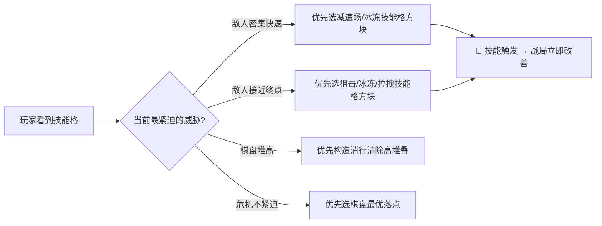
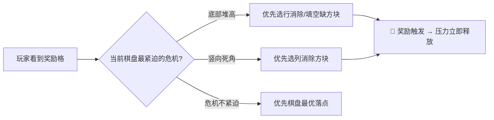

---
tags:
  - game-design
  - pressure-curve
  - reward
  - balance
  - elementris
aliases:
  - 压力与奖励曲线
  - 心流设计
  - 压力设计
created: 2026-04-02
updated: 2026-04-08
---

# 04 — 压力与奖励曲线

## 设计目标

> [!abstract] 核心目标
> 构建「双线压力心流」：玩家同时承受**棋盘压力**（底部增行 → 满棋盘失败）和**塔防压力**（敌人持续行进 → 到达终点漏怪扣血），通过消行触发子弹攻击和技能格能力来化解两条压力线。

```
心流曲线示意：
压力
 ↑
 │    底部增行峰值   敌人密集波次   底部增行峰值
 │   ╭────╮         ╭──╮         ╭────╮
 │  ╱      ╲  消行  ╱    ╲  消行 ╱      ╲
 │ ╱        ╲──────╱      ╲────╱          ╲──
 └─────────────────────────────────────────→ 时间
```

---

## 压力机制

### 压力来源一：底部增行

> [!info] 周期增行规则
> - 棋盘**周期性**从底部插入一行砖块，整个棋盘向上推移一行
> - 每行含有**随机缺口**（默认1-3个），缺口玩家可正常向下堆叠
> - 增行速率随关卡进度**线性加快**

#### 增行参数表

| 难度阶段 | 增行间隔 | 每行缺口数 | 设计意图 |
| -------- | -------- | ---------- | -------- |
| 阶段1 | 30秒/行 | 3个缺口 | 轻松入门，建立节奏感 |
| 阶段2 | 22秒/行 | 2个缺口 | 开始形成压力 |
| 阶段3 | 16秒/行 | 2个缺口 | 中等压力 |
| 阶段4 | 12秒/行 | 1-2个缺口 | 高压，需妥善规划 |
| 阶段5 | 10秒/行 | 1个缺口 | 极限压力 |

---

### 压力来源二：敌人行进

> [!info] 详见 [[03-塔防战斗系统]]
> 敌人持续沿棋盘三边行进，无法停止。玩家必须通过消行产生的子弹和技能格能力来消灭敌人，否则敌人到达终点，生命值被扣除。

#### 敌人波次压力节奏

| 难度阶段 | 敌人数量 | 敌人速度 | 敌人HP | 压力感知 |
| -------- | -------- | -------- | ------ | -------- |
| 阶段1 | 少量普通敌 | 慢 | 低 | ⚡ 轻微 |
| 阶段2 | 普通 + 少精英 | 中慢 | 中 | ⚡⚡ 适中 |
| 阶段3 | 普通 + 精英 | 中 | 中高 | ⚡⚡⚡ 显著 |
| 阶段4 | 密集普通 + 精英 | 中快 | 高 | ⚡⚡⚡⚡ 高压 |
| 阶段5 | 含Boss波次 | 快 | 极高 | ⚡⚡⚡⚡⚡ 极限 |

---

## 技能格机制（奖励）

> [!tip] 技能格内嵌设计
> 在5选1方块生成时，**有概率**在候选方块的最1个格子中生成技能格标记，用对应技能图标区分类型。
> 含技能格的行被完整消除时，**立即触发**对应的塔防主动技能效果。

### 技能格类型速览

| 分类 | 代表技能 | 核心效果 |
| ---- | -------- | -------- |
| 攻击类 | 狙击/爆裂/链式闪电/破甲 | 高伤、范围伤、穿甲 |
| 控制类 | 冰冻/减速场/震荡/拉拽 | 停止、减速、集体控制 |
| 全场类 | 陨石雨/燃烧地带/宇宙爆发 | 随机/持续/一键清场 |
| 辅助类 | 护盾强化/增幅 | 容错保命、短期增伤 |

> 完整技能详情见 [[03-塔防战斗系统#塔防技能列表]]

### 技能格生成概率控制

> [!note]
> - 每次生成3个候选方块时，**概率30%生成1个含技能格的方块**
> - 3个方块中最多同时出现1个技能格（避免泛滥）
> - 技能类型从已解锁池中随机抽取，玩家可能为了获取特定技能而调整方块选择

### 技能格的心流价值



---

## 心流节奏设计

### 压力-释放周期对照

| 压力事件       | 强度  | 对应释放机制           | 时间尺度    |
| ---------- | --- | ---------------- | ------- |
| 底部新增一行     | 中   | 消行推高后消除（即时）      | 短线      |
| 敌人接近终点     | 高   | 消行子弹击杀 / 冰冻/拉拽技能 | 极短（当前轮） |
| 敌人密集成群     | 高   | 爆裂/闪电/陨石雨/减速场技能  | 短期      |
| 棋盘堆高接近顶部   | 高   | 多行连消 / 增幅技能      | 中期      |
| 敌人到达终点（漏怪） | 极高  | 生命扣除 / 护盾技能补救    | —       |
| 满棋盘        | 极高  | ❌ 即时游戏失败         | —       |
| 技能格暴露      | —   | 主动构造消行触发技能       | 短期（数步内） |

### 整体节奏节点（单局参考）

```
时间轴（分钟）：
0  ────── 2  ────── 5  ────── 8  ────── 12  ────── 15+
│          │          │          │           │          │
│ 入门期    │ 适应期    │ 挑战期    │ 高压期     │ 极限期    │ 继续...
│ 熟悉操作  │ 首波精英  │ 双线压力  │ 密集波次   │ Boss登场  │
│ 底部增行  │ 敌人出现  │ 同时显著  │ 满棋盘风险 │ 技能依赖  │
│ 节奏感建立│ 技能格初现 │           │ 增加       │ 增加      │
```

---

**相关文档：** [[02-游戏机制]] | [[03-塔防战斗系统]] | [[06-技术架构]] | [[CONFIG-关卡配置表]] | [[00-ELEMENTRIS-总索引]]


# 04 — 压力与奖励曲线

## 设计目标

> [!abstract] 核心目标
> 构建「双向夹击心流」：棋盘受到来自底部的增行压力与来自顶部的干扰方块压力双重挤压，玩家通过消行、触发奖励消除格来周期性化解压力，保持在心流区间内。

```
心流曲线示意：
压力
 ↑
 │    底部增行峰值   干扰方块触发   底部增行峰值
 │   ╭────╮         ╭──╮         ╭────╮
 │  ╱      ╲  消行  ╱    ╲  消行 ╱      ╲
 │ ╱        ╲──────╱      ╲────╱          ╲──
 └─────────────────────────────────────────→ 时间
```

---

## 压力机制

### 压力来源一：底部增行

> [!info] 周期增行规则
> - 棋盘**周期性**从底部插入一行砖块，整个棋盘向上推移一行
> - 每行含有**随机缺口**（默认1-3个），缺口玩家可正常向下堆叠
> - 增行速率随关卡进度**线性加快**

#### 增行参数表

| 难度阶段 | 增行间隔 | 每行缺口数 | 设计意图 |
| -------- | -------- | ---------- | -------- |
| 阶段1 | 30秒/行 | 3个缺口 | 轻松入门，建立节奏感 |
| 阶段2 | 22秒/行 | 2个缺口 | 开始形成压力 |
| 阶段3 | 16秒/行 | 2个缺口 | 中等压力 |
| 阶段4 | 12秒/行 | 1-2个缺口 | 高压，需妥善规划 |
| 阶段5 | 10秒/行 | 1个缺口 | 极限压力 |

---

### 压力来源二：干扰方块

> [!info] 详见 [[03-干扰方块与预警系统]]
> 游戏周期性从棋盘顶部投放干扰方块，先预警后掉落，形成间歇性突发压力，与底部增行的持续背景压力形成节奏差异。

#### 干扰频率与底部增行联动

| 难度阶段 | 底部增行间隔 | 干扰投放间隔 | 合并压力强度 |
| -------- | ------------ | ------------ | ------------ |
| 阶段1 | 30秒 | 40秒 | ⚡ 低 |
| 阶段2 | 22秒 | 30秒 | ⚡⚡ 中低 |
| 阶段3 | 16秒 | 22秒 | ⚡⚡⚡ 中 |
| 阶段4 | 12秒 | 16秒 | ⚡⚡⚡⚡ 高 |
| 阶段5 | 10秒 | 12秒 | ⚡⚡⚡⚡⚡ 极限 |

---

## 奖励方块机制

> [!tip] 强力消除奖励内嵌设计
> 在5选1方块生成时，**有概率**在候选方块的最1个格子中生成奖励标记，用图标区分奖励类型。
> 该格子被消行消除时，**立即触发**对应的强力棋盘操作效果。

### 奖励类型

| 奖励类型 | 图标 | 触发效果 | 设计意图 |
| -------- | ---- | -------- | -------- |
| 行消除 | 🔥 | **立即消除**奖励格所在列下方第一个不完整的行（强制清行） | 直接化解底部压力，高价值奖励 |
| 列消除 | ⚡ | **立即清除**奖励格所在列的全部方块 | 化解竖向堆叠死角，重塑棋盘结构 |
| 填空缺 | ✨ | **填满**棋盘最底层不完整行的所有空格（触发消除） | 加速完成已接近满行的行，快速释放压力 |

> [!note] 奖励生成概率控制
> - 每次生成3个候选方块时，**概率生成1个含奖励格的方块**（建议初始概率30%）
> - 3个方块中最多同时出现1个奖励格（避免过于泛滥）
> - 玩家可能为了获取奖励格而改变原本最优的方块选择（策略张力）

### 奖励方块的心流价值



---

## 心流节奏设计

### 压力-释放周期对照

| 压力事件 | 强度 | 对应释放机制 | 时间尺度 |
| -------- | ---- | ------------ | -------- |
| 底部新增一行 | 中 | 消行（立即）| 即时（短线） |
| 干扰方块预警出现 | 中 | 快速调整当前方块落点 | 极短（预警期内）|
| 干扰方块落地未消除 | 高 | 后续消行清除干扰方块 | 短期（数步内）|
| 棋盘堆高接近顶部 | 高 | 连消/奖励消除格化解 | 中期 |
| 满棋盘（新方块无法生成）| 极高 | ❌ 游戏失败，无法释放 | — |
| 奖励格暴露 | — | 主动构造消行触发强力效果 | 短期（数步内）|

### 整体节奏节点（单局参考）

```
时间轴（分钟）：
0  ────── 2  ────── 5  ────── 8  ────── 12  ────── 15+
│          │          │          │           │          │
│ 入门期    │ 适应期    │ 挑战期    │ 高压期     │ 极限期    │ 继续...
│ 熟悉操作  │ 首个干扰  │ 双线压力  │ 频繁干扰   │ 紧张化解  │
│ 底部增行  │ 方块出现  │ 开始显著  │ 满棋盘风险 │ 奖励依赖  │
│ 节奏感建立│           │           │ 增加       │ 增加      │
```

---

**相关文档：** [[02-游戏机制]] | [[03-干扰方块与预警系统]] | [[06-技术架构]] | [[CONFIG-关卡配置表]] | [[00-ELEMENTRIS-总索引]]
