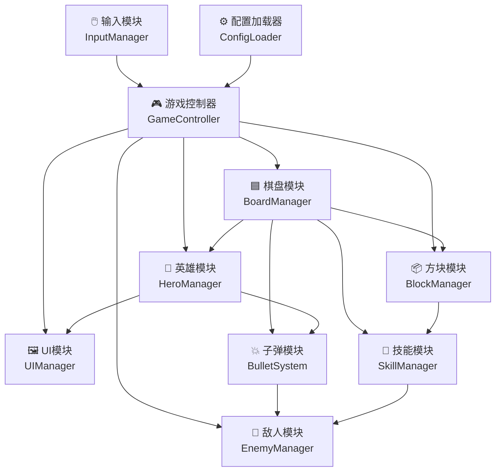
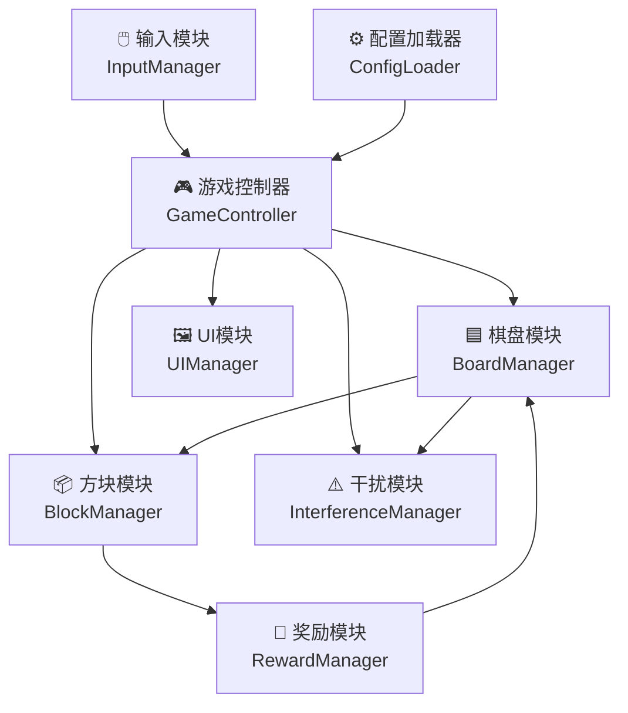

---
tags:
  - game-design
  - tech-architecture
  - engineering
  - elementris
aliases:
  - 技术架构
  - 模块设计
created: 2026-04-02
updated: 2026-04-08
---

# 06 — 技术架构

## 技术栈

| 层次 | 技术选型 | 说明 |
| ---- | -------- | ---- |
| 渲染层 | HTML5 Canvas / Phaser 3 | 移动端高性能渲染，支持粒子/曲线动画 |
| 游戏逻辑 | JavaScript / TypeScript | 核心状态机管理 |
| 输入层 | Touch Events API | 点触/拖拽/释放三种输入 |
| 配置数据 | JSON 配置文件 | 与设计表解耦，支持热更新 |
| 音效 | Howler.js | 轻量音效管理 |
| 本地存储 | localStorage | 本局存档、最高分 |
| 曲线计算 | 自定义贝塞尔工具函数 | 子弹飞行路径计算 |

---

## 模块划分

### 核心模块关系图



---

## 各模块职责

### GameController（游戏主控制器）

> [!info] 职责
> - 管理全局游戏状态（IDLE / PLAYING / PAUSED / GAME_OVER / VICTORY）
> - 驱动每帧更新（Update Loop）
> - 协调各子模块间的事件通信
> - 管理难度阶段进度（阶段1~5）
> - 管理玩家生命值（漏怪扣血 / 技能回血 / 生命归零）

**关键状态机：**

```
IDLE ──start()──→ PLAYING
PLAYING ──pause()──→ PAUSED
PAUSED ──resume()──→ PLAYING
PLAYING ──boardFull──→ GAME_OVER
PLAYING ──hpZero──→ GAME_OVER
PLAYING ──waveComplete──→ VICTORY（待定）
```

---

### BoardManager（棋盘管理器）

| 功能 | 说明 |
| ---- | ---- |
| 棋盘状态维护 | 10×20 二维数组，存储每格的占用状态与格子类型 |
| 消行检测 | 每次方块落定后检测完整行 |
| 子弹发射触发 | 消行时通知 BulletSystem 发射本行格子对应的子弹 |
| 技能格检测 | 消行时检测是否包含技能格，通知 SkillManager 执行 |
| 底部增行 | 定时向棋盘底部插入新行，推送上方内容 |
| 满棋盘检测 | 方块生成区域被占据时触发 GAME_OVER |
| Ghost Piece 计算 | 根据当前方块位置实时计算落点 |

---

### BlockManager（方块管理器）

| 功能 | 说明 |
| ---- | ---- |
| 方块池管理 | 维护3个插槽的候选方块状态 |
| 随机生成（软约束）| 随机形状 + 随机旋转，执行软约束检测避免全废牌 |
| 技能格注入 | 生成时按概率从技能池随机抽取技能格注入某格子 |
| 选中状态 | 响应玩家点触/拖拽，标记当前选中方块 |
| 活动方块控制 | 管理当前在棋盘上下落的方块的位置和速度 |
| 释放下落 | 释放时触发快速下落动画（非瞬移） |

---

### EnemyManager（敌人管理器）

| 功能 | 说明 |
| ---- | ---- |
| 敌人生成 | 按波次配置在左下角起点生成敌人 |
| 路径行进 | 计算每帧敌人在三边路径上的移动位置 |
| HP管理 | 接收 BulletSystem / SkillManager 的伤害事件，更新HP |
| 到达终点 | 敌人到达右下角终点时，通知 GameController 扣除生命值 |
| 死亡处理 | HP归零时播放死亡动效并从场上移除 |
| 状态效果 | 管理减速/冰冻/眩晕等状态，影响每帧移动速度计算 |
| 优先级排序 | 维护路径进度排序，供 BulletSystem 确认攻击目标 |

---

### BulletSystem（子弹系统）

| 功能 | 说明 |
| ---- | ---- |
| 子弹生成 | 消行时每格生成1颗子弹，记录起点格坐标 |
| 智能目标选取 | 查询路径进度排序，检测#1 HP阈值决定攻击#1还是#2 |
| 暴击倍率 | 接收消行数量（1/2/3/4行），注入对应倍率（×1/1.5/2/3）|
| 贝塞尔路径 | 计算子弹从格子位置到敌人位置的贝塞尔曲线控制点 |
| 飞行动画 | 驱动子弹沿曲线飞行，约 250~400ms 到达；暴击时变色+加粗 |
| 伤害结算 | 子弹到达目标时调用 EnemyManager.applyDamage() |
| 视觉特效 | 暴击时额外播放对应等级的特效（橙/红/彩虹） |

---

### HeroManager（英雄管理器）

| 功能 | 说明 |
| ---- | ---- |
| 经验管理 | 接收 BoardManager 消行事件，按行数计算 XP 并累积 |
| 升级检测 | XP满时置 pendingLevelUp=true，通知 GameController 暂停 |
| 技能选择UI | 向 UIManager 触发技能选择面板，展示3张随机技能卡（各构筑1张）|
| 技能注册 | 玩家选择后注册被动效果，注入相关模块（BulletSystem / EnemyManager 等）|
| 构筑状态 | 维护已获得技能列表，防止重复出现同一技能 |
| HUD 同步 | 每帧更新 UIManager 中英雄经验环进度和等级显示 |

---

### ConfigLoader（配置加载器）

> [!info] 配置文件来源
> 所有数值配置从 JSON 文件加载，支持不重新打包直接修改调参。

| 配置文件 | 对应设计表 |
| -------- | ---------- |
| `skills.json` | [[CONFIG-奖励效果配置表]] |
| `enemies.json` | [[CONFIG-敌人配置表]] |
| `levels.json` | [[CONFIG-关卡配置表]] |

---

## 数据结构参考

### 棋盘格子类型

```typescript
enum CellType {
  EMPTY = 0,
  BLOCK = 1,           // 普通方块格
  SKILL_CELL = 2,      // 技能格（内嵌塔防技能）
  GHOST = 3,           // Ghost Piece（仅渲染用）
  BOTTOM_ROW = 4,      // 底部增行格
}
```

### 方块定义

```typescript
interface Block {
  shape: ShapeType;         // I/O/T/S/Z/J/L
  rotation: number;         // 0/1/2/3
  cells: [number, number][]; // 相对坐标列表
  skillCell?: {
    cellIndex: number;
    skillId: SkillId;        // SKL_SNIPE | SKL_BURST | SKL_FREEZE | 等
  };
}
```

### 敌人定义

```typescript
interface Enemy {
  id: string;
  type: EnemyType;           // NORMAL | ELITE | BOSS
  hp: number;
  maxHp: number;
  speed: number;             // 路径进度/秒（0.0~1.0）
  armor: number;             // 伤害减免百分比
  leakDamage: number;        // 到达终点扣玩家生命数
  pathProgress: number;      // 当前路径进度（0.0~1.0）
  statusEffects: StatusEffect[]; // 减速/冰冻/眩晕等
}
```

### 子弹定义

```typescript
interface Bullet {
  startPos: { x: number, y: number };  // 格子世界坐标
  targetEnemyId: string;               // 目标敌人ID
  damage: number;
  critMultiplier: number;              // 1.0/1.5/2.0/3.0（多行暴击）
  bezierControlPoint: { x: number, y: number };
  progress: number;                    // 0.0~1.0 飞行进度
}
```

### 英雄定义

```typescript
interface HeroState {
  level: number;                       // 当前等级 1~6
  xp: number;                         // 当前经验
  xpToNextLevel: number;              // 升至下一级所需经验
  acquiredSkills: HeroSkillId[];       // 已获得的英雄技能列表
  pendingLevelUp: boolean;            // 是否正在等待玩家选择技能
}

interface HeroSkill {
  id: HeroSkillId;
  buildType: 'damage' | 'control' | 'clear';
  name: string;
  effect: (gameState: GameState) => void; // 被动效果注入
}
```

---

**相关文档：** [[02-游戏机制]] | [[03-塔防战斗系统]] | [[07-版本规划]] | [[08-英雄与构筑系统]] | [[00-ELEMENTRIS-总索引]]


# 06 — 技术架构

## 技术栈

| 层次 | 技术选型 | 说明 |
| ---- | -------- | ---- |
| 渲染层 | HTML5 Canvas / Phaser 3 | 移动端高性能渲染 |
| 游戏逻辑 | JavaScript / TypeScript | 核心状态机管理 |
| 输入层 | Touch Events API | 点触/拖拽/释放三种输入 |
| 配置数据 | JSON 配置文件 | 与设计表解耦，支持热更新 |
| 音效 | Howler.js | 轻量音效管理 |
| 本地存储 | localStorage | 本局存档、最高分 |

---

## 模块划分

### 核心模块关系图



---

## 各模块职责

### GameController（游戏主控制器）

> [!info] 职责
> - 管理全局游戏状态（IDLE / PLAYING / PAUSED / GAME_OVER / VICTORY）
> - 驱动每帧更新（Update Loop）
> - 协调各子模块间的事件通信
> - 管理难度阶段进度（阶段1~5）

**关键状态机：**

```
IDLE ──start()──→ PLAYING
PLAYING ──pause()──→ PAUSED
PAUSED ──resume()──→ PLAYING
PLAYING ──boardFull──→ GAME_OVER
PLAYING ──stageComplete──→ VICTORY（如有关卡目标）
```

---

### BoardManager（棋盘管理器）

| 功能 | 说明 |
| ---- | ---- |
| 棋盘状态维护 | 10×20 二维数组，存储每格的占用状态与格子类型 |
| 消行检测 | 每次方块落定后检测完整行 |
| 奖励格检测 | 消行时检测是否包含奖励格，触发 RewardManager |
| 底部增行 | 定时向棋盘底部插入新行，推送上方内容 |
| 满棋盘检测 | 方块生成区域被占据时触发 GAME_OVER |
| Ghost Piece 计算 | 根据当前方块位置实时计算落点 |
| 强力消除执行 | 接收 RewardManager 的行消除/列消除/填空缺指令并执行 |

---

### BlockManager（方块管理器）

| 功能 | 说明 |
| ---- | ---- |
| 方块池管理 | 维护3个插槽的候选方块状态 |
| 随机生成 | 随机形状 + 随机旋转状态，注入 RewardManager 奖励分配 |
| 选中状态 | 响应玩家点触/拖拽，标记当前选中方块 |
| 活动方块控制 | 管理当前在棋盘上下落的方块的位置和速度 |
| 释放下落 | 释放时触发快速下落动画（非瞬移） |

---

### InterferenceManager（干扰管理器）

| 功能 | 说明 |
| ---- | ---- |
| 干扰计时器 | 按当前难度阶段的投放间隔触发干扰事件 |
| 落点随机选定 | 随机选取1~N列作为干扰落点 |
| 预警显示 | 通知 UIManager 在预警区显示对应列的预警标记 |
| 预警倒计时 | 倒计时结束后触发干扰方块实际落下 |
| 干扰方块下落 | 创建干扰方块并执行快速下落动画到栈顶 |
| 难度同步 | 监听 GameController 的阶段变更，更新间隔/预警时间参数 |

---

### RewardManager（奖励管理器）

| 功能 | 说明 |
| ---- | ---- |
| 奖励格生成 | 按概率在方块某格子中注入奖励类型（行消除/列消除/填空缺） |
| 触发处理 | 接收 BoardManager 的消行奖励格事件，路由到对应操作 |
| 行消除路由 | 调用 BoardManager.forceRemoveRow(targetRow) |
| 列消除路由 | 调用 BoardManager.clearColumn(col) |
| 填空缺路由 | 调用 BoardManager.fillLowestIncompleteRow() |

---

### ConfigLoader（配置加载器）

> [!info] 配置文件来源
> 所有数值配置从 JSON 文件加载，支持不重新打包直接修改调参。

| 配置文件 | 对应设计表 |
| -------- | ---------- |
| `interference.json` | [[CONFIG-干扰方块配置表]] |
| `rewards.json` | [[CONFIG-奖励效果配置表]] |
| `levels.json` | [[CONFIG-关卡配置表]] |

---

## 数据结构参考

### 棋盘格子类型

```typescript
enum CellType {
  EMPTY = 0,
  BLOCK = 1,           // 普通方块格
  REWARD_ROW = 2,      // 奖励格：行消除
  REWARD_COL = 3,      // 奖励格：列消除
  REWARD_FILL = 4,     // 奖励格：填空缺
  GHOST = 5,           // Ghost Piece（仅渲染用）
  BOTTOM_ROW = 6,      // 底部增行格
  INTERFERENCE = 7,    // 干扰方块格
}
```

### 方块定义

```typescript
interface Block {
  shape: ShapeType;         // I/O/T/S/Z/J/L
  rotation: number;         // 0/1/2/3
  cells: [number, number][]; // 相对坐标列表
  rewardCell?: {
    cellIndex: number;
    rewardType: RewardType;  // ROW_CLEAR | COL_CLEAR | FILL_GAPS
  };
}
```

### 干扰方块定义

```typescript
interface InterferenceBlock {
  type: InterferenceType;    // SINGLE | HORIZONTAL_2 | L_SHAPE
  targetCols: number[];      // 目标落点列索引
  warningDuration: number;   // 预警时间（秒）
}
```

---

**相关文档：** [[02-游戏机制]] | [[03-干扰方块与预警系统]] | [[07-版本规划]] | [[00-ELEMENTRIS-总索引]]
