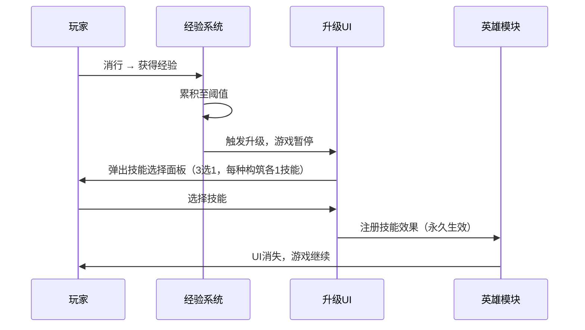

---
tags:
  - game-design
  - hero
  - build
  - progression
  - elementris
aliases:
  - 英雄系统
  - 构筑系统
  - 英雄成长
created: 2026-04-08
updated: 2026-04-08
---

# 08 — 英雄与构筑系统

> [!abstract] 系统概述
> 英雄模块是游戏的**长线累积型成长层**。与技能格（即时压力释放）的短周期节奏不同，英雄经验通过消行缓慢积累，每次升级暂停游戏并呈现「3选1英雄技能」，构建跨关卡的战略套路。
>
> 英雄系统的核心设计价值：
> - 为硬核玩家提供**构筑乐趣**（定义流派风格）
> - 提供**重开驱动力**（每局构筑方向不同）
> - 补充**长周期正向反馈**（升级时的仪式感停顿）

---

## 英雄 HUD 展示

```
┌────────────────────────────────────────┐
│  [🧙‍♂️]   分数  ║  波次  ║  ❤️❤️❤️   [阶段]  │
│  ○───●   ← 英雄经验环形进度（左上角）         │
└────────────────────────────────────────┘
```

### 英雄头像区域规范

| 元素 | 设计说明 |
| ---- | -------- |
| 位置 | HUD 左上角，暂停按钮位置改为紧挨头像右侧 |
| 头像 | 圆形裁剪，固定尺寸约 40×40px（移动端） |
| 经验环 | 围绕头像圆形的**环形进度条**，顺时针增长 |
| 经验环颜色 | 空=深灰；填充中=金色渐变；满经验=高亮白色脉冲 |
| 等级标记 | 头像右下角小圆形数字标（Lv.1~Lv.9） |
| 升级动画 | 经验环填满时，环炸裂散开光效，随后弹出技能选择界面 |

---

## 经验系统

### 经验获取规则

| 触发时机 | 获得 XP | 说明 |
| -------- | ------- | ---- |
| 消除 1 行 | +1 XP | 基础回报 |
| 消除 2 行（Double）| +3 XP | 多行消除额外奖励（+1倍） |
| 消除 3 行（Triple）| +5 XP | 技巧奖励 |
| 消除 4 行（TETRIS!）| +8 XP | 最高技巧奖励 |
| 技能格触发 | +1 XP | 附加奖励，鼓励技能格利用 |

> [!note] 设计意图
> 多行消除比单行消除获得更高 XP，与暴击伤害倍率形成**双重激励**——玩家有充足动力追求多行消除操作。

### 升级所需 XP（各等级阈值）

| 等级 | 升至下一级所需 XP | 累计 XP |
| ---- | --------------- | ------- |
| Lv.1 → Lv.2 | 12 XP | 12 |
| Lv.2 → Lv.3 | 16 XP | 28 |
| Lv.3 → Lv.4 | 20 XP | 48 |
| Lv.4 → Lv.5 | 25 XP | 73 |
| Lv.5 → Lv.6 | 30 XP | 103 |
| Lv.6+（封顶）| — | — |

> [!note] 等级上限
> 单局内英雄最高升至 **Lv.6**（可获得5次技能选择），防止后期英雄技能叠加过度失衡。

---

## 英雄技能升级流程



### 技能选择面板设计

| 元素 | 设计说明 |
| ---- | -------- |
| 布局 | 全屏半透明暗化遮罩 + 居中3张技能卡片横排 |
| 技能卡片 | 大图标 + 技能名 + 2~3行效果描述 + 构筑标签（🔴输出 / 🔵控制 / 🟢消除） |
| 每次展示规则 | 从三种构筑各随机抽1个**当前未持有的技能**，共3张 |
| 选择后 | 卡片高亮动效，其余渐出，游戏在0.5秒动画后自动恢复 |
| 无障碍文字 | 卡片底部小字显示「当前已持有技能 X/5」 |

---

## 三大构筑套路

> [!tip] 设计原则
> 三个套路的定位清晰区分，各有独特的策略实现路径；英雄技能取得后立即生效，无需主动激活；套路之间允许混搭，但专精一条线收益更高。

---

### 🔴 高伤害套路（Damage Build）

**核心定位**：放大子弹输出，追求单次消行的伤害峰值，适合喜欢「爆发型清场」的玩家。

| 技能ID | 技能名 | 图标 | 效果描述 |
| ------ | ------ | ---- | -------- |
| `HRO_FURY_SHOT` | 烈焰弹道 | 🔥 | 每格基础伤害永久 **+1**（累计可获得多次） |
| `HRO_DOUBLE_SHOT` | 双重打击 | 🎯 | 每次消行时额外产生 **3 发强化子弹**（伤害×2）飞向当前目标 |
| `HRO_CRIT_UP` | 暴击强化 | 💢 | 所有消行暴击倍率**提升系数×1.2**（2行: ×1.8, 3行: ×2.4, 4行: ×3.6） |
| `HRO_EXECUTE` | 斩杀 | ⚔️ | 对当前 **HP≤15%** 的目标直接击杀，触发击杀闪光 |
| `HRO_OVERFLOW` | 溢出传导 | ➡️ | 超出目标HP的溢出伤害**传递给下一个敌人**（传递率70%） |

---

### 🔵 强控制套路（Control Build）

**核心定位**：延缓敌人进度，提升每轮消行对威胁压制的时间窗口，适合喜欢「稳扎稳打」的玩家。

| 技能ID | 技能名 | 图标 | 效果描述 |
| ------ | ------ | ---- | -------- |
| `HRO_SLOW_AURA` | 寒冰领域 | ❄️ | 被动：路径上所有敌人持续受到 **-20%** 速度减益（无需技能格） |
| `HRO_CC_MASTERY` | 控制精通 | 🌀 | 所有控制类技能格（冰冻/减速/震荡/拉拽）效果持续时间 **+2秒** |
| `HRO_FREEZE_KILL` | 冰封之怒 | 🧊 | 每次击杀敌人时，自动冻结击杀位置附近 **1个敌人 2秒** |
| `HRO_CHAIN_PULL` | 引力锚 | 🪝 | 每次消行后，路径进度最高的敌人 **向起点退回3%路径** |
| `HRO_SHIELD_EXT` | 护盾扩展 | 🛡️ | `SKL_SHIELD`技能格效果增强：回复 **2** 点生命 + 下次 **4次** 漏怪免伤 |

---

### 🟢 消除增强套路（Clear Build）

**核心定位**：提升棋盘操控效率，降低棋盘压力，放大多行消除的触发能力，适合喜欢「连消爽快」的玩家。

| 技能ID | 技能名 | 图标 | 效果描述 |
| ------ | ------ | ---- | -------- |
| `HRO_CLEAR_SENSE` | 消行预判 | 👁️ | 棋盘右侧实时显示每行**距完整消行还差几格**的数字提示 |
| `HRO_CHAIN_BONUS` | 连消加成 | 🔗 | **3秒内**连续消行，每次额外产生 **5发追踪子弹** 飞向当前目标 |
| `HRO_BOMB_ROW` | 爆破排 | 💣 | 每消 **累计3行**，自动将最靠近满格的行清除（不限是否完整） |
| `HRO_EXTRA_SLOT` | 方块扩展 | ➕ | 方块槽从 **5选1** 升级为 **6退1**（增加1个候选槽） |
| `HRO_SKILL_ECHO` | 技能共鸣 | ✨ | 每次技能格触发时，额外发射 **5发普通子弹**（相当于额外1次消行输出） |

---

## 构筑协同分析

| 混合构筑 | 协同方式 | 适合场景 |
| -------- | -------- | -------- |
| 高伤 + 消除 | `HRO_CHAIN_BONUS` + `HRO_CRIT_UP` → 连消窗口内暴击加成叠加 | 中后期密集波次，快速清场 |
| 控制 + 消除 | `HRO_SLOW_AURA` + `HRO_CHAIN_BONUS` → 敌人被动减速，给连消多次机会 | Boss波次周期内争取多次消行 |
| 高伤 + 控制 | `HRO_EXECUTE` + `HRO_FREEZE_KILL` → 斩杀触发冻结形成连锁 | 密集精英混合波次 |

---

## 构筑平衡约束

> [!warning] 防止无限叠加的边界规则

| 技能 | 叠加规则 |
| ---- | -------- |
| `HRO_FURY_SHOT` | 可多次获得，每次+1基础伤害，上限 **+3**（共获得3次后池中移除） |
| `HRO_DOUBLE_SHOT` | 仅触发1次，不可重复获得 |
| `HRO_CRIT_UP` | 仅触发1次，不可重复获得 |
| `HRO_BOMB_ROW` 触发阈值 | 每消3累计行触发一次，不被加速（防止频繁免费消行破坏棋盘压力）|
| `HRO_EXTRA_SLOT` | 仅生效1次，不重复出现 |

---

## 成就/标签系统（可选扩展）

> [!info] 未来扩展方向
> 若三大构筑套路被玩家高度完成，可在局末结算界面显示构筑标签：
> - 🔴 炮台毁灭者（高伤构筑满级）
> - 🔵 冰封领主（控制构筑满级）
> - 🟢 无限连消（消除增强满级）
>
> 标签无实际数值效果，为社交炫耀/挑战目标设计。

---

**相关文档：** [[01-核心概述]] | [[03-塔防战斗系统]] | [[04-压力与奖励曲线]] | [[05-界面设计]] | [[06-技术架构]] | [[00-ELEMENTRIS-总索引]]
